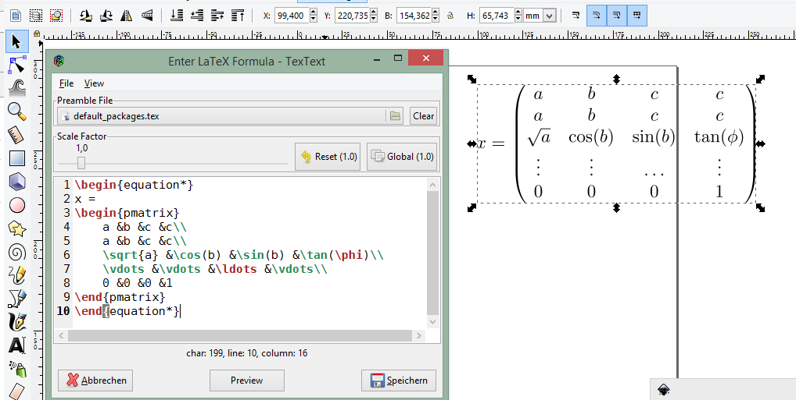

# Tex Text 0.7.2 - A LaTeX extension for Inkscape (releases 0.92, 0.91 and 0.48)

TexText is a Python plugin for the vector graphics editor [Inkscape](http://www.inkscape.org) providing the possibility to add LaTeX generated SVG elements to your drawing. This repository continues the development of the plugin which took place at [https://bitbucket.org/pitgarbe/textext](https://bitbucket.org/pitgarbe/textext) until January 2018. Originally, TexText had been developed by [Pauli Virtanen](http://www.iki.fi/pav/software/textext/) based on the plugin InkLaTeX written by Toru Araki.



### Very important - broken pstoedit support by ghostscript
On all platforms pstoedit support is broken by ghostscript releases 9.21 and later. Please make sure that you have ghostscript version 9.20 or prior installed! We are working hard on a fix by migrating the converter engine to pdf2svg or the Inkscape command line itself.

**Note:** There are more sophisticated instructions, including pictures, in the docs directory of this repository:  [README-TexText.pdf](docs/README-TexText.pdf) or [README-TexText.html](docs/README-TexText.html)

## Features
- Typesetting of beautiful equations using LaTeX which are placed as SVG objects in your document.
- LaTeX equation objects can be edited later (in contrast to the built in LaTeX-tool).
- Free scaling and coloring of the objects possible.
- Usage of user defined preamble files (e.g., to include special packages, etc.).

## New in relase 0.7.2 (2018-04-06)
- Fixed: Failure on missing Inkscape version key (issue #10: "Error occurred while converting text from LaTeX to SVG")

[(go to full release history...)](#markdown-header-release-history)

## Prerequisites

- A LaTeX distribution (e.g., TeX Live [Linux, Windows, MaxOS] or MiKTeX [Windows only]) has to be installed, especially `pdflatex` is needed.
- You need the 32-bit or 64-bit version of Inkscape releases 0.92, 0.91 or 0.48
- Depending on your operating system some extra software is required, see the specific instructions below.
- **Important:** If you use Inkscape 0.92 please ensure that the python 2.7 interpreter has been selected during the installation of Inkscape (by default this is the case).


## Installation for Linux [(go to Windows instructions...)](#markdown-header-installation-for-windows).

### Tex Text Extension

 Download    | SHA-256 Checksum
-------------|-------------------
[TexText-Linux-0.7.2,tgz](https://github.com/textext/textext/releases/download/0.7.2/TexText-Linux-0.7.2.tgz) | 532132eb52be721fd1e3a2cc57006b544812db16935aeb09f6b435a40ce84110
[TexText-Linux-0.7.2.zip](https://github.com/textext/textext/releases/download/0.7.2/TexText-Linux-0.7.2.zip) | 2772e1606c84d713fe4b821fe61a28974fa0fb5028e7e1fc09d76103491114c8

To install *Tex Text*, simply download the package and extract it. A directory with the name `textext-0.7.2-linux` will be created. Change into the directory and run `python setup.py` in your terminal. All it does, is copying the necessary files to your Inkscape extension directory. If you don't trust this script, you'll have to copy all the files within the `extensions` directory of the extracted archive to `~/.config/inkscape/extensions/`.

### Additional required software

- You'll need to install GtkSourceView (`python-gtksourceview2` on Ubuntu/Debian) to take advantage of all the GUI features of *Tex Text*. This package should install `python-gtk2` as well, but if your distribution works differently, make sure you install the Python Gtk+ bindings. Also ensure that the package `gnome-themes-standard` is installed to avoid annoying GTK-warnings after creating a LaTeX node.

- Next, please install `pstoedit`.

- The extension also needs Ghostscript. This should already be included with your LaTeX distribution. However, **make sure** that Ghostscript version 9.20 or earlier is installed. The utility pstoedit **DOES NOT** work with Ghostscript 9.21 and newer.

- Finally, to enable the preview feature of *Tex Text*, you need to install `ImageMagick`.


### Congratulations, you're done! [Show Usage...](#markdown-header-usage)


## Installation for Windows

### Tex Text Extension

 Download   | SHA-256 Checksum
------------|-------------------
[TexText-Windows-0.7.2.exe](https://github.com/textext/textext/releases/download/0.7.2/TexText-Windows-0.7.2.exe) | d4f0b1e0c483f5949e487dc8979fd5feeec35f75224b81dbc531133582362682

The installation of *Tex Text for Inkscape* is straightforward: Simply use the installer and follow the instructions (basically, click *Next*, *Install* and *Done*, since you usually won't even have to change the installation directory). It will copy the required files into the user's Inkscape configuration directory (usually this is `%USERPROFILE%\AppData\Roaming\Inkscape`) and put a key into the Windows registry which is used to store configuration data of the extension.


## Additional required software

### PyGTK

After that, you have to install PyGTK. Depending on your Inkscape version you need to download one of the following installers:

 Inkscape Version (**important!**) | PyGTK Installer (SHA-256 Checksum)
-----------------------------------|-----------------------------------
 Inkscape 0.92.2 - 64-bit | [Install-PyGTK-2.24-Inkscape-0.92.2-64bit.exe](https://github.com/textext/textext/releases/download/0.7/Install-PyGTK-2.24-Inkscape-0.92.2-64bit.exe)
 | c8e2e7551f253afb736a1f4f936a40dc116ad14bec7eac0c548b18a0a6e7e066
 Inkscape 0.92.2 - 32-bit | [Install-PyGTK-2.24-Inkscape-0.92.2-32bit.exe](https://github.com/textext/textext/releases/download/0.7/Install-PyGTK-2.24-Inkscape-0.92.2-32bit.exe)
 | 7356f8d3232c038b2fff50d5cf608044c7c911db4f0b20d230bd5504a5cb20f9
 Inkscape 0.92.0 and 0.92.1 (64- and 32-bit)| [Install-PyGTK-2.24-Inkscape-0.92.exe](https://github.com/textext/textext/releases/download/0.7/Install-PyGTK-2.24-Inkscape-0.92.exe)
 | a2ea5842084aa5f6fdc1880ae4ad135135f5ff0423bb0cd527a8f0cf95f7ffd6
 Inkscape 0.91 and 0.48  (64- and 32-bit) | [Install-PyGTK-2.24-Inkscape-0.48+0.91.exe](https://github.com/textext/textext/releases/download/0.7/Install-PyGTK-2.24-Inkscape-0.48+0.91.exe)
 | 1189df2eb90d1229b850bbba75def3b39306f303f9e34415d34eaf58cda6a05c

The installer will search for your Inkscape installation and puts the required files into the directory of Inkscape. An uninstaller is installed by the installer, too.

If you do not trust the installer you can download one of the following zip archives and copy its content into the directory in which inkscape.exe resides (Inkscape version 0.92.2) or directly into the `python` directory of your Inkscape installation (Inkscape versions 0.48, 0.91, 0.92.0, 0.92.1):

 Inkscape Version | PyGTK zip-archive (SHA-256 Checksum)
------------------|-------------------------------------
Inkscape 0.92.2 - 64-bit | [PyGTK-2.24.2-Python-2.7-Inkscape-0.92.2-64bit.zip](https://github.com/textext/textext/releases/download/0.7/PyGTK-2.24.2-Python-2.7-Inkscape-0.92.2-64bit.zip)
 | db67a38bd4214e155446228cf0103b8d2b40e655c25b54574fab8f4f94a1dcdb
Inkscape 0.92.2 - 32-bit | [PyGTK-2.24.2-Python-2.7-Inkscape-0.92.2-32bit.zip](https://github.com/textext/textext/releases/download/0.7/PyGTK-2.24.2-Python-2.7-Inkscape-0.92.2-32bit.zip)
 | 7bc3e3123391827ac87e0be44a694959c7adf206b71af49a665ffe66b46ca8df
Inkscape 0.92.0 and 0.92.1 | [PyGTK-2.24.2-Python-2.7-Inkscape-0.92.zip](https://github.com/textext/textext/releases/download/0.7/PyGTK-2.24.2-Python-2.7-Inkscape-0.92.zip)
 | ff3dac6e6a01dfad1b4bfe831e8d363a06500c2673e5e692a36e0fdee065e2e0
Inkscape 0.91 and 0.48 | [PyGTK-2.24.2-Python-2.6-Inkscape-0.48+0.91.zip](https://github.com/textext/textext/releases/download/0.7/PyGTK-2.24.2-Python-2.6-Inkscape-0.48+0.91.zip) 
 | 15f35a48d7b3558aadc9f8c7a2b9da8da0f66c8dfb88fb6c5e0230e58d64c080


### Even more software that you might need to install

If you don't already have *Ghostscript*, *pstoedit* and *ImageMagick* installed on your machine, you'll have to install these as well. Depending on your machines architecture (32- or 64-bit) you find the corresponding packages under the following links:

- The installers for *pstoedit* are `pstoeditsetup-win32.exe` (32-bit) or `pstoeditsetup-x64.exe` (64-bit) which  can be found under [https://sourceforge.net/projects/pstoedit/files/pstoedit/3.70](https://sourceforge.net/projects/pstoedit/files/pstoedit/3.70)

- To install *ImageMagick*, run `ImageMagick-6.9.7-x-Q16-x86-static.exe` (32-bit) or `ImageMagick-6.9.7-x-Q16-x64-static.exe`(64-bit)  which can be downloaded from [ftp://ftp.imagemagick.org/pub/ImageMagick/binaries/](ftp://ftp.imagemagick.org/pub/ImageMagick/binaries/) (more recent versions have not been tested yet)

-  The installers for *Ghostscript* `gs920w32.exe` (32-bit) or `gs920w64.exe` (64-bit) can be downloaded from [32-bit]( https://github.com/ArtifexSoftware/ghostpdl-downloads/releases/download/gs920/gs920w32.exe) and [64-bit](https://github.com/ArtifexSoftware/ghostpdl-downloads/releases/download/gs920/gs920w64.exe
) **DO NOT install ghostscript 9.21 or 9.22!!**

**Note:** The 32-bit version of Inkscape is able to use the 64-bit versions of these programs and vice versa.


### Congratulations, you're done!

## Usage

The extension menu in Inkscape will now contain a new entry named *Tex Text*.

When you select it, a dialog will appear that lets you enter any LaTeX code you want (presumably your formula). It will highlight the syntax with colors, show you line numbers and more. Above the text field you can choose a scale factor between 0.1 and 10 in increments of 0.1. You can also choose a preamble file from your disk which shall be used for rendering your LaTeX code.

Basically, your LaTeX code will be inserted into this environment:

```
\documentclass[preview]{standalone}
***preamble file content***
\pagestyle{empty}
\begin{document}
***Your code***
\end{document}
```

This will be typeset, converted to SVG and inserted into your Inkscape document.

Your LaTeX code and the accompanying settings (scale factor and optionally a preamble file) will be stored within the new SVG node in the document. This allows you to edit the LaTeX node later by selecting it and running the *Tex Text* extension (which will then show the dialog containing the saved values).

Any applied color or other styles will be kept when you update the LaTeX node using *Tex Text*.

There is a preview button as well, which shortens the feedback cycle from entry to result considerably, so use it! (It requires ImageMagick to be installed.)

## Known Issues

- Currently, colors set within the LaTeX code (`\textcolor{...}` in combination with an added `\usepackage{color}` in the preamble file) are ignored.
- Nodes which are scaled manually in Inkscape are messed up after recompiled via TexText. Originally, TexText has not been designed to provide this capability. However, this issue will be fixed in Version 0.8 auf TexText thanks to the support of @sizmailov.
- TexText fails to produce output if a ghostscript version later 9.20 is installed on your system. This is due to broken pstoedit support by ghostscript > 9.20 and cannot directly addressed by TexText.
- Under windows the Tkinter version of the GUI fails to open due to a bug in Inkscape. This will be fixed by the Inkscape team in Inkscape 0.92.3 Use the GTK interface instead.


## Release history

### New in relase 0.7.1 (2018-02-06)
- Fixed: Wrong scaling so that text with explicitly defined font size does not match size of text with equal font size in Inkscape 0.92.x (issue #1)
- Fixed: "Zero length field name in format" error in Inkcape <= 0.91 (issue #6)

For releases <= 0.7 issue numbers refer to [BitBucket](https://bitbucket.org/pitgarbe/textext/issues?status=new&status=open)

### New in release 0.7 (2017-12-15)
- New: Compatibility with Inkscape 0.92.2 also under Windows
- New: Global and local scale factor. This feature enables the user to set the scale factor of a node to the value used while editing the previous node (Button "Global"). Hence, it is easier to change several nodes to the same scale factor. It is always possible to reset the scale factor to the value used for creating the node (Button "Reset").
- New: Added compatibility to ImageMagick 7 (version 6 is still supported) (issue #32, #39)
- Workaround: A message is displayed if pstoedit failed to produce svg output and ghostscript < 9.21 is installed on the system (issues #44, #48, #50 on [BitBucket](https://bitbucket.org/pitgarbe/textext/issues?status=new&status=open)).
- See [CHANGELOG.txt](CHANGELOG.txt) for more information and history

### New in release 0.6.1 (2017-02-10)
- Fixed bug #18
- Introduced proposals #19 and #20
- Full compatibility with Inkscape 0.92
- Full compatibility with 64-bit installations of Inkscape under MS Windows
- See [CHANGELOG.txt](CHANGELOG.txt) for more information and history

