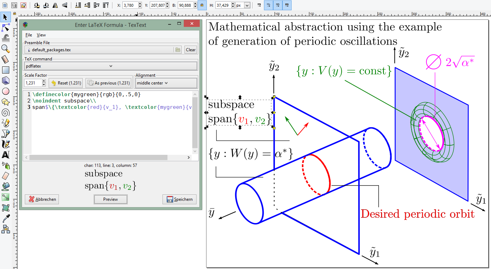

TexText - Re-editable LaTeX graphics for Inkscape
=================================================

TexText is a Python extension for the vector graphics editor
`Inkscape <http://www.inkscape.org/>`__ providing the possibility to add
and *re-edit* LaTeX generated SVG elements to your drawing.

Key features
------------

-  Compatible with Inkscape **1.x** and **0.92**
-  Windows/ Linux/ MacOS support
-  LaTeX generated SVG elements can be re-edited later
-  Multi-line editor with syntax highlighting
-  Compilation with **PdfLaTeX**, **XeLaTeX** or **LuaLaTex**
-  Interoperable scaling in TexText and Inkscape
-  Customizable TeX preamble (additional packages, parskip, parindent, etc.)
-  Colorization via TeX commands/ Inkscape is kept after re-editing
-  Alignment anchor of the produced output
-  Font size match with Inkscape text
-  Preview images
-  Compatibility with TexText down to version 0.4.x

.. note::
    If you are using Inkscape **0.92** please use the :ref:`discontinued release 0.11 of TexText <tt0x>`

.. _installation-toc:

.. toctree::
    :caption: Installation
    :maxdepth: 1

    install/linux
    install/windows
    install/macos
    install/advanced

.. _usage-toc:

.. toctree::
    :caption: Usage
    :maxdepth: 1

    usage/gui
    usage/faq
    usage/troubleshooting

.. toctree::
    :caption: Deprecated versions
    :maxdepth: 2
    :hidden:
    :glob:

    textext_0x/textext_0x.rst

.. toctree::
    :caption: Credits
    :maxdepth: 1

    history.rst
    authors.rst

.. toctree::
    :caption: Changelog
    :maxdepth: 2

    changelog.rst
