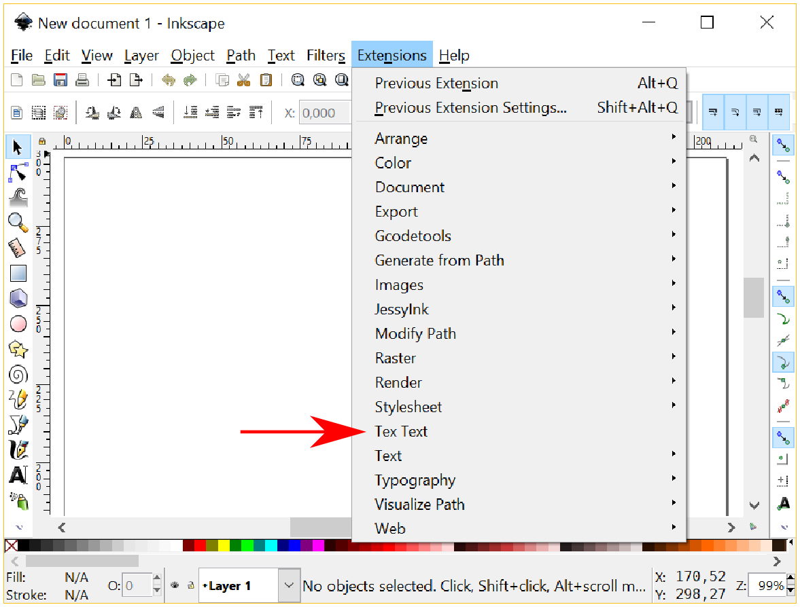
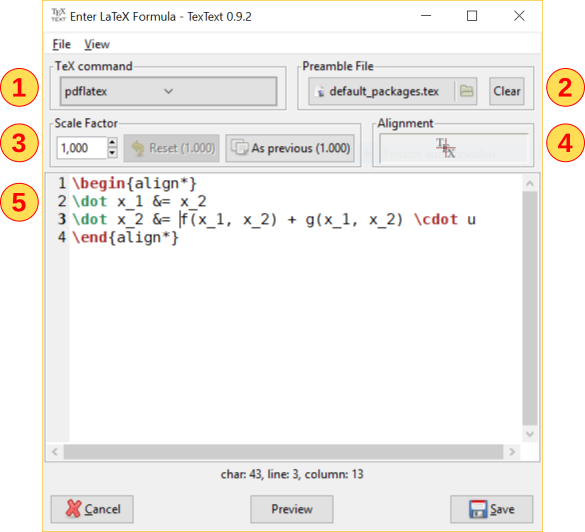
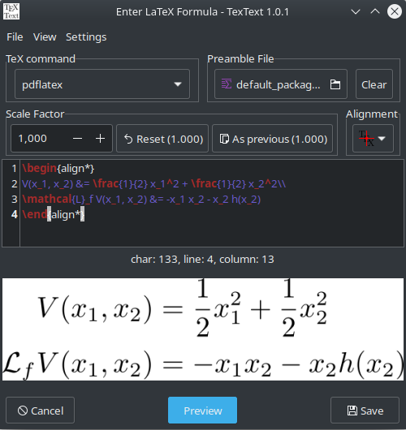
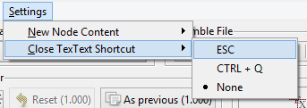
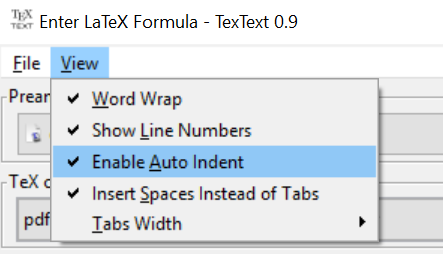

.. |TexText| replace:: **TexText**

.. role:: bash(code)
   :language: bash
   :class: highlight

.. role:: latex(code)
   :language: latex
   :class: highlight

.. |usage-label-3| image:: ../images/annotation_label_3.png
            :height: 1em
            :width: 1em
            :target: usage-dialog-overview_

.. |usage-label-4| image:: ../images/annotation_label_4.png
            :height: 1em
            :width: 1em
            :target: usage-dialog-overview_

.. |usage-label-5| image:: ../images/annotation_label_5.png
            :height: 1em
            :width: 1em
            :target: usage-dialog-overview_

.. |usage-label-6| image:: ../images/annotation_label_6.png
            :height: 1em
            :width: 1em
            :target: usage-dialog-overview_

.. |usage-label-7| image:: ../images/annotation_label_7.png
            :height: 1em
            :width: 1em
            :target: usage-dialog-overview_

.. |usage-label-8| image:: ../images/annotation_label_8.png
            :height: 1em
            :width: 1em
            :target: usage-dialog-overview_

.. |tl| image:: ../images/alignment-top-left.svg.png
            :target: usage-alignment_

.. |tc| image:: ../images/alignment-top-center.svg.png
            :target: usage-alignment_

.. |tr| image:: ../images/alignment-top-right.svg.png
            :target: usage-alignment_

.. |ml| image:: ../images/alignment-middle-left.svg.png
            :target: usage-alignment_

.. |mc| image:: ../images/alignment-middle-center.svg.png
            :target: usage-alignment_

.. |mr| image:: ../images/alignment-middle-right.svg.png
            :target: usage-alignment_

.. |bl| image:: ../images/alignment-bottom-left.svg.png
            :target: usage-alignment_

.. |bc| image:: ../images/alignment-bottom-center.svg.png
            :target: usage-alignment_

.. |br| image:: ../images/alignment-bottom-right.svg.png
            :target: usage-alignment_

.. _gui:

The |TexText| GUI
=================

.. contents:: :local:

.. _usage-extension-entry:

Invoking |TexText| extension
----------------------------

After installation |TexText| will appear under :menuselection:`Extensions --> Text --> Tex Text`:

When you select it, a dialog will appear that lets you enter any LaTeX
code you want (presumably your formula).

.. tip:: Once you have opened |TexText| via the menu entry in an Inkscape session
   you can subsequently open it using the keyboard shortcut :bash:`ALT` + :bash:`Q`
   ("Previous extension").

   Alternatively, you can specify your own keyboard shortcut, see :ref:`define-keyboard-shortcut`
   in the FAQ.

.. _usage-dialog-overview:

Dialog overview
---------------

You enter your LaTeX code into the edit box |usage-label-5|. In the case the
the GTK GUI bindings are available it will show you line and column numbers. If you
additionally installed GTKSourceView it will also highlight the syntax
with colors. You can add any valid and also multi-line LaTeX code.
There are additional settings which can be adjusted to your needs:

-  The TeX command to be used for compiling your code (group box |usage-label-1|).
   Possible options are: :bash:`pdflatex`, :bash:`xelatex`, :bash:`lualatex`. See
   section :ref:`usage-tex-compilers` for more details.
-  Custom :ref:`usage-preamble-file` (group box |usage-label-2|)
-  The scale factor (group box |usage-label-3|). See section :ref:`usage-scaling`.
-  The alignment relative to the previous version of your code (group
   box |usage-label-4|, only available when re-editing your code). See section :ref:`usage-alignment`.
-  Options for the produced SVG output (checkbox |usage-label-5|). See section :ref:`usage-colorization`.
-  The coloring of the output using TeX commands or Inkscape settings.
   See section :ref:`usage-colorization`.
-  The default math environment in new nodes (menu |usage-label-8|), see section :ref:`usage-default-math-environment-config`.
-  The appearance of the editor (menu |usage-label-9|), see section :ref:`usage-gui-config`.

Your LaTeX code and the accompanying settings will be stored within the
new SVG node in the document. This allows you to edit the LaTeX node
later by selecting it and running the *Tex Text* extension (which will
then show the dialog containing the saved values).

There is a preview button |usage-label-7| as well, which shortens the feedback cycle
from entry to result considerably, so use it! See section :ref:`usage-preview`

.. _usage-tex-compilers:

Available TeX compilers
-----------------------

Your LaTeX code can be compiled using three different compilers:
:bash:`pdflatex`, :bash:`xelatex`, :bash:`lualatex` (as long as the corresponding
commands are found by your system). You can select the command in the
combobox |usage-label-1|. The last two ones are especially useful for using UTF-8
input or if you require Lua commands. Of course you can use UTF-8 input
with the :bash:`pdflatex` command as well as long as you provide
:latex:`\usepackage[utf8]{inputenc}` in your preamble file (see :ref:`usage-preamble-file`).

Some things to be kept in mind:

 - Place the required lua packages in your `preamble file <usage-preamble-file_>`_ if you want to
   compile your code with :bash:`lualatex`.
 - If you use :bash:`lualatex`/ :bash:`xelatex` for the very first time on your
   system it may take some time until the fonts are setup properly.
   During that time |TexText| might be unresponsive.
 - Windows: :bash:`xelatex` tends to be very slow on Windows machines, see
   this post on
   `Stackexchange <https://tex.stackexchange.com/questions/357098/compiling-tex-files-with-xelatex-is-insanely-slow-on-my-windows-machine/357100>`__.

.. _usage-preamble-file:

Preamble file
-------------
Be aware of including the required packages in the *preamble file* if you
use special commands in your code that rely on such packages. The
preamble file can be chosen by the selector |usage-label-2|. The default preamble
file shipped with |TexText| includes the following:

.. code-block:: latex

    \documentclass{article}

    \usepackage{amsmath,amsthm,amssymb,amsfonts}
    \usepackage{color}

Basically, your LaTeX code will be inserted into this environment:

.. code-block:: latex

    % ***preamble file content***
    \pagestyle{empty}
    \begin{document}
    % ***Your code***
    \end{document}

This will be typeset, converted to SVG and inserted into your Inkscape
document. If no :latex:`\documentclass` or :latex:`\documentstyle` is specified
in the preamble file, :latex:`\documentclass{article}` is used by default.

.. _usage-scaling:

Scaling of the output
---------------------

In most of the cases you will need to adjust the size of the produced
SVG output to match the conditions of your drawing. This can be done by
two methods:

1. After compilation adjust the size of the SVG output using the mouse
   in Inkscape. You should lock the width and height to keep the
   proportion. Be careful to not break the group!

    .. figure:: ../images/inkscape-scaling-locked.png
       :alt: Locked scaling in Inkscape

2. Before compilation you specify a scale factor in the spinbox of the
   groupbox |usage-label-3|.

    .. figure:: ../images/textext-scale-factor.png
       :alt: TexText scale factor

Both methods are fully compatible. If you scale your SVG output in
Inkscape the numerical value of the spinbox will be adjusted
appropriately when you open |TexText| on that node later. In both cases
the scale factor is preserved when you re-edit your code.

A scale factor of 1 means that the output is sized as it would appear in
a regular LaTeX document, i.e., a font size of ``x pt`` in LaTex matches
that of ``x pt`` in Inkscape:

.. figure:: ../images/texttext-fontsize-example.png
   :alt: Font size example

There are two additional buttons in the groupbox |usage-label-3|:

-  *Reset*: This button is only available when re-editing existing
   |TexText| nodes. It resets the scale factor to the value the code has
   been compiled with the last time. This is useful when playing around
   with the scale factor and decide to not change the scale factor.
-  *As previous*: This button sets the scale factor of the currently
   edited node to the value of the node which has been edited
   previously. This is useful when you found a scale factor to be
   suitable and want to apply this scale factor also to any new or
   existing nodes you open for editing.

If you have re-sized the SVG output in Inkscape *without* keeping the
proportions the re-compiled output will be placed with correct
proportions according to the `alignment <usage-alignment_>`_.

.. _usage-alignment:

Alignment of the output
-----------------------

When you edit existing nodes it is likely that the size of the produced
output will change, for example if you modify the input :latex:`$\sin(x)$` to
:latex:`$\int\sin(x)\text{d}x$`. The entries of the spinbox |usage-label-4| determine how
the new node is aligned relatively to the old node. The default
behaviour is ``middle center``, i.e. the middle of the new node is placed
on the middle of the old node. Available options are:

+-----------------+-------------------+------------------+
| |tl|            | |tc|              | |tr|             |
|                 |                   |                  |
| ``top left``    | ``top center``    | ``top right``    |
+-----------------+-------------------+------------------+
| |ml|            | |mc|              | |mr|             |
|                 |                   |                  |
| ``middle left`` | ``middle center`` | ``middle right`` |
+-----------------+-------------------+------------------+
| |bl|            | |bc|              | |br|             |
|                 |                   |                  |
| ``bottom left`` | ``bottom center`` | ``bottom right`` |
+-----------------+-------------------+------------------+

.. figure:: ../images/textext-alignment-example.png
   :alt: Alignment example

Of course, the content of the groupbox |usage-label-4| is only available when
editing existing nodes.

.. _usage-colorization:

Colorization of the output
--------------------------

There are two ways for colorization of the output:

 1. The most natural way is to select the produced SVG output in Inkscape and set the fill
    color to the same value according to your needs. When you re-compile your node this color will be persevered as long as
    you do not use any color specifications in your LaTeX code.

    .. versionadded:: 1.5.0
       *No strokes* checkbox

    Note, that bars occuring in ``\frac``, ``\sqrt``, ``\overline`` and other commands are
    colored only by this method if you check the ``No strokes`` option in the ``SVG-Output``
    box |usage-label-5| (see :ref:`usage-dialog-overview`). Please note that setting
    of this option will considerably increase compilation time due to Inkscape API
    limitations. Hence, this option is disabled by default in new nodes.

    .. figure:: ../images/textext-stroke-to-path-color-issue.png
       :alt: Explanation of stroke to path colorization issue

    You can also colorize characters individually be selecting them with the mouse
    after having pressed :kbd:`F2`. Be careful not to break the group.

    .. caution::

       Individual colorization of *single characters* done in Inkscape *will not* be
       kept after re-compilation.

 2. Alternatively, you can use LaTeX commands like
    :latex:`\textcolor` in your code to colorize the node according to your
    needs. The required color package is already included in the ``default_packages.tex``
    preamble file shipped with |TexText|. If you use such commands any colorization done
    by Inkscape will be lost after re-compilation. This method is the recommended one if you
    would like a character wise colorization of your output.

.. _usage-preview:

Preview button
--------------

When pressing the ``Preview`` button |usage-label-7| your code will be compiled and the result
is displayed as an image in the area below the LaTeX code input field. If the
output extends a certain size it is displayed scaled so it fits into the available
area. You can double click into the preview image to obtain the result in original
size. Then, you can use the horizontal and vertical scroll bars to navigate along
your result. Double clicking again will bring you back to the scaled version of the
output.

.. figure:: ../images/textext-dialog-preview.png
   :alt: Annotated TexText dialog

If you are using a darkmode theme you can select the option ``White preview background``
option from the ``View`` menu |usage-label-9|:

.. image:: ../images/textext-dialog-preview-standardmode.png
   :width: 45%
   :alt: Selection of white preview background

Finally, click the ``Save`` button to insert the compiled code into your document.

.. note::

    This feature is not available in the Tkinter GUI!

.. _usage-default-math-environment-config:

Configuration of the default TeX math-environment
-------------------------------------------------

You can open the ``Settings`` menu |usage-label-8| and then ``New Node Content``
to define which environment should be selected by default when creating new nodes.

.. figure:: ../images/textext-dialog-with-settings-menus-new-node.png
    :alt: TexText settings menu (new node content)

You have the following options:

- ``Empty``: The code editor is empty.

- ``Inline math``: The code editor is filled with ``$$`` for typesetting an inline math expression.

- ``Display math``: The code editor is filled with ``$$$$`` for typesetting a display math expression.

(`Reminder on the difference between inline and display math <https://en.wikibooks.org/wiki/LaTeX/Mathematics#Mathematics_environments>`_)

.. note::

    This feature is not available in the Tkinter GUI!

.. _usage-close-shortcut-config:

Selecting the shortcut for closing the |TexText| window
-------------------------------------------------------

.. versionadded:: 0.11.0

In the ``Settings`` menu |usage-label-8| you can configure by ``Confirm Closing Window`` if |TexText| should ask for
confirmation to close the window in case you made changes to your text. Furthermore, under ``Close TexText Shortcut``
you can select a shortcut for closing the |TexText| window.

You have the following options:

- ``Escape`` (default)

- ``CTRL + Q``

- ``None``: No shortcut active. Depending on your operating system a standard shortcut maybe
  available (e.g. ``ALT`` + ``F4`` on Windows).

.. note::

    This feature is not available in the Tkinter GUI!

.. _usage-gui-config:

Configuration of the code editor
--------------------------------

You can open the ``View`` menu |usage-label-9| which offers some possibilities
to configure the code editor:

- ``Font Size``: Here you can set the font size used in the code editor (since version 1.7.0).

- ``Word Wrap``: If this option is checked long lines are wrapped automatically to window width.

- ``Show line numbers``: If this option is checked line numbers are printed on the left hand side of the editor.

- ``Enabled auto indent``: If this option is checked current indentation is preserved when breaking a new line (this is not an intelligent code dependent indentation feature).

- ``Insert spaces instead of Tabs`` If this option is checked each time you press the ``Tab`` key a number of spaces as defined in ``Tabs Width`` is inserted instead of a tabulator character.

.. note::

   The last three options are only available if you have ``GTKSourceView`` installed
   together with ``GTK`` (see installation instructions :ref:`linux-install`,
   :ref:`windows-install`, :ref:`macos-install`)

Further reading
---------------

See :ref:`faq` and :ref:`troubleshooting`
