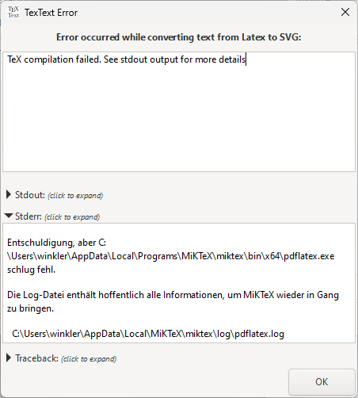

.. |TexText| replace:: **TexText**
.. |Lin| replace:: **Linux/ MacOS**
.. |Win| replace:: **Windows**

.. role:: bash(code)
   :language: bash
   :class: highlight

.. role:: latex(code)
   :language: latex
   :class: highlight

.. _troubleshooting:

Troubleshooting
---------------

.. contents:: :local:
    :depth: 1

.. _trouble_installation:

Installation problems
=====================

The setup script offers several command line options which may help to fix the
most common problems during the installation process. For this purpose open a
Terminal or Windows Command Prompt and enter one of the commands listed below:

- Inkscape is not found by the installation script -> specify the path to the executable:

    - |Lin|

    .. code-block:: bash

        python setup.py --inkscape-executable '/path/to/my Inkscape/inkscape'

    - |Win| (note the double quotes!)

    .. code-block:: bash

        setup_win.bat --inkscape-executable "C:\My\Installation Location\bin\inkscape.exe"

- Inkscape does not find |TexText| although it has been installed -> notify the setup script
  about a user-defined (non-standard) installation location for the Inkscape extensions

    - |Lin|

    .. code-block:: bash

        python setup.py --inkscape-extensions-path '/path/to/user defined/location'

    - |Win| (note the double quotes!)

    .. code-block:: bash

        setup_win.bat --inkscape-extensions-path "C:\Users\My extension location"

- The LaTeX engines are not found in the system path by the setup script -> specify the
  path to the executables:

    - |Lin|

    .. code-block:: bash

        python setup.py --pdflatex-executable '/path/to/my latex/pdflatex'

    also available: ``--lualatex-executable`` and ``--xelatex-executable`` for the LuaLaTex and
    XeLaTeX executables, respectively.

    - |Win| (note the double quotes!)

    .. code-block:: bash

        setup_win.bat --pdflatex-executable "C:\Program Files\My Latex\pdflatex.exe"

    also available: ``--lualatex-executable`` and ``--xelatex-executable`` for the LuaLaTex and
    XeLaTeX executables, respectively.

- Completely skip all requirement checks during installation and just copy the |TexText| files into
  the extension directory:

    - |Lin|

    .. code-block:: bash

        python setup.py --skip-requirements-check

    - |Win|

    .. code-block:: bash

        setup_win.bat --skip-requirements-check

- General help:

    - |Lin|

    .. code-block:: bash

        python setup.py --help

    - |Win|

    .. code-block:: bash

        setup_win.bat --help

.. important::

    Do not hesitate to file a report if you cannot solve your installation problems:
    `github <https://github.com/textext/textext/issues/new/choose>`_

Problems running |TexText|
==========================

There are three main reasons why something may went wrong:

1. Your LaTeX code contains invalid commands or syntax errors.

2. The installed toolchain for the conversion of your code to a valid SVG element
   is for some reason broken.

3. |TexText| contains a bug and you are the person who discovered it!

|TexText| helps you to resolve such issues by offering detailed error and logging information.

This section is structured as follows:

.. contents:: :local:

.. _trouble_latex:

LaTeX and toolchain errors
~~~~~~~~~~~~~~~~~~~~~~~~~~

If compilation of your LaTeX code fails |TexText| opens a dialog displaying the
cause of the failure. In most cases a syntax error in your code will be the reason.
|TexText| filters the relevant information from the compiler output and displays
it:

If you would like to see the full output of the LaTeX processor, click on the ``+``
left to the ``stdout`` label:

Sometimes nothing meaningful can be stripped from the LaTeX processor output, or
nothing has been produced by LaTeX which can be parsed by |TexText|:

.. figure:: ../images/textext-error-dialog-empty.png
   :scale: 50 %
   :alt: empty error dialog

Most likely something serious failed during compilation and you may find additional
information under ``stderr`` , click on the ``+`` left to this label:

In that case follow the information given in the window (in the example given here:
open the pdflatex.log in the AppData path).

.. note::

   The ``stderr`` option is only available when errors have been piped by the
   failed command.

.. _trouble_bugs:

Bugs in |TexText|
~~~~~~~~~~~~~~~~~

Of course, |TexText| may contain bugs which may crash the plugin. If this happens
an Inkscape error dialog is opened that will show something like this:

.. figure:: ../images/textext-error-dialog-python-error-1.png
    :scale: 50 %
    :alt: Error dialog after failed execution

Note the advice at the end of the text view: You should run the extension again.
Then, a logging mechanism is started which writes its result into the Inkscape
error dialog:

.. figure:: ../images/textext-error-dialog-python-error-2.png
    :scale: 50 %
    :alt: Error dialog after failed execution, second run

You can use this information to further analyze the problem or to
open an issue on GitHub asking for help: https://github.com/textext/textext/issues/new

.. important::
    Please carefully read the instructions in the issue template on GitHub so you
    pass all the required information to the developer team.

.. _trouble_manual_compile:

Manual use of the toolchain
~~~~~~~~~~~~~~~~~~~~~~~~~~~

For debugging purposes it may be required to manually process the steps usually done automatically
by |TexText|. This procedure is also helpful if the result generated by |TexText| does not match
your expectations at all and you are unsure if this is an error of |TexText| itself or of the
programs used in the toolchain. Here is what you have to do in such cases:

1. Create a LaTeX document ``test.tex`` with the following content:

    .. code-block:: latex

        \documentclass{article}
        \usepackage{amsmath,amsthm,amssymb,amsfonts}
        \usepackage{color}
        \pagestyle{empty}
        \begin{document}
        % ***Your code***
        \end{document}

    Replace ``% ***Your code***`` by the LaTeX code you want to compile and save the file to disk.

2. Open a Terminal (Linux, MacOS) or Command Window (Windows)

    - On Linux: Open a file manager (e.g. Nautilus, Dolphin), navigate to
      directory of ``test.tex``. Right click and select ``Open in Terminal`` (Nautilus)
      or simply press ``F4`` (Dolphin).

    - On Windows: Open the explorer, navigate to the directory of ``test.tex`` and press
      ``SHIFT + F10``, then select ``Open Command Window Here`` from the context menu.

3. Compile this file using the command

    .. code-block:: bash

        pdflatex test.tex -interaction=nonstopmode -halt-on-error

    .. note::

        On Windows it may be required to put the name of the directory in which ``pdflatex.exe``
        resides in front of ``pdflatex``, e.g. ``c:\Program Files\MiKTeX 2.9\miktex\bin\x64\``.

4. If compilation succeeds open the generated file ``test.pdf`` with a pdf viewer and
   check its content. If it is as expected proceed with the next step.

5. Check if the conversion from ``pdf`` to ``svg`` succeeds:

    .. code-block:: bash

        inkscape --pdf-poppler --pdf-page=1 --export-type=svg --export-text-to-path --export-area-drawing --export-filename test.svg test.pdf

    .. note::

        On Windows it may be required to put the name of the directory in which ``inkscape.exe``
        resides in front of ``inkscape``, e.g. ``c:\Program Files\Inkscape\bin\``.

    Open the generated file ``test.svg`` with Inkscape and check the result.

6. Check if the conversion of the strokes to paths in the ``svg`` succeeds:

    .. code-block:: bash

        inkscape -g --batch-process --actions="EditSelectAll;StrokeToPath;export-filename:test.svg;export-do;EditUndo;FileClose" test.svg

    .. note::

        On Windows it may be required to put the name of the directory in which ``inkscape.exe``
        resides in front of ``inkscape``, e.g. ``c:\Program Files\Inkscape\bin\``.

    Open the generated file ``test.svg`` with Inkscape and check the result (Visually there will
    be no difference between the svg generated in this step and that from step 5).

7. Check if the conversion from ``svg`` to ``png`` for the preview image succeeds

    .. code-block:: bash

        inkscape --pdf-poppler --pdf-page=1 --export-type=png --export-area-drawing --export-dpi=300 --export-filename test.png test.pdf

    .. note::

        On Windows it may be required to put the name of the directory in which ``inkscape.exe``
        resides in front of ``inkscape``, e.g. ``c:\Program Files\Inkscape\bin\``.

    Open the generated file ``test.png`` with an image viewer and check the result.